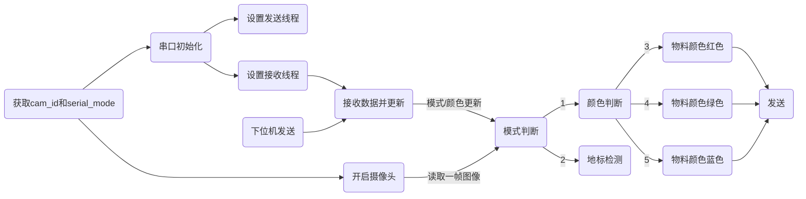
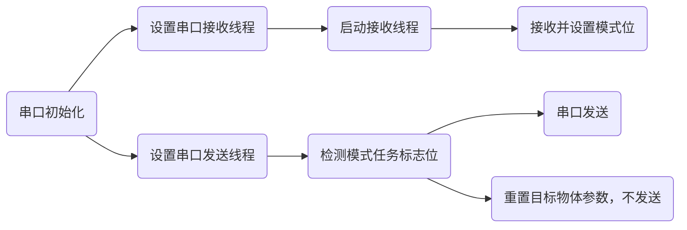
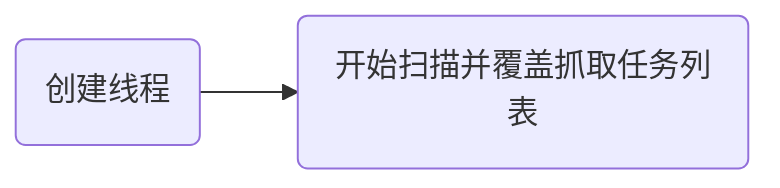

@[TOC](2023工程实践与创新能力大赛-智能物流分拣)

# 任务需求：
>原文：在比赛过程中机器人必须完全自主运行，应具有定位、移动、避障、读取二维码、条形码及无线通信、物料位置和颜色识别、物料抓取与载运、路径规划等功能。

小组讨论后视觉应该完成 `物料位置和颜色识别、物料抓取` 的功能

# 必读：
**config.py 和 parameter.py 中包含绝大多数主要文件所需要的变量，一定要结合这两个文件看。**

# 文件功能速览：
## main.py
    1、读取配置文件
    2、开启摄像头
    3、开启串口
    4、物料识别
    5、地标识别
    6、边缘检测（Not Use）
## seialport.py
    1、定义发送接收数据包内容
    2、串口发送与接收
    3、多线程串口发送与接收
## WiFi_Scanner.py
    1、扫描WiFi获取符合条件的Wifi
## config.yaml
    1、摄像头、串口号
    2、串口通信信号默认值
    3、物料颜色、圆环颜色阈值
    4、边缘阈值
## parameter.py
    1、模式位
    2、目标物体参数
    3、Wifi 扫描信息


# 文件功能详解
## main.py

### 工作流程

### 函数解释
开启摄像头
```
def open_camera(cam_id):
    cap = cv.VideoCapture(cam_id)
    cap.set(cv.CAP_PROP_FPS, 30)
    return cap
```

**主要功能：原料区物料检测**
```
def Materail_detect(img,color):
```

**主要功能：地标检测**
```
def Land_mark_Detect(img, color):
```

**主要功能：边缘检测(虽然主要，但是比赛中没用到)**
```
def Land_mark_Detect(img, color):
```
补码转换（边缘检测用到）：斜率可能会出现负值，而且基本不会超出-128~127的范围
```
def int_to_binary_complement(number):
```

## serialport.py
### 整体流程：

### 函数说明

**开启串口功能 包含初始化，启动接收发送线程**
```
def Serial_Start():
```
**串口初始化**
```
def serial_init():
```
**生成串口数据并发送**
```
def send_serial_data(serial):
```
**接收数据并处理**
```
def receive_serial_data(ser):
```
## Wifi Scanner.py
**该部分使用Github开源程序 https://github.com/kootenpv/access_points 感谢**

### 整体流程

### 函数说明
**扫描SSID获取符合321-123格式的字符串并修改任务列表**
```
def Wifi_Scan_Start():
```
**WiFi扫描线程设置**
```
def Wifi_Scanner_thread(): 
```
