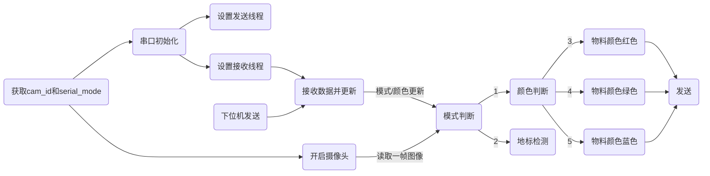
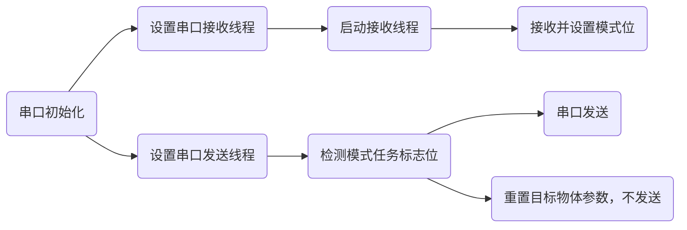

# 2023工程实践与创新能力大赛-智能物流分拣-沈阳航空航天大学
- [2023工程实践与创新能力大赛-智能物流分拣-沈阳航空航天大学](#2023工程实践与创新能力大赛-智能物流分拣-沈阳航空航天大学)
- [任务需求：](#任务需求)
- [必读：](#必读)
- [文件功能速览：](#文件功能速览)
  - [main.py](#mainpy)
  - [seialport.py](#seialportpy)
  - [WiFi\_Scanner.py](#wifi_scannerpy)
  - [config.yaml](#configyaml)
  - [parameter.py](#parameterpy)
- [文件功能详解](#文件功能详解)
  - [main.py](#mainpy-1)
    - [工作流程](#工作流程)
    - [函数解释](#函数解释)
  - [serialport.py](#serialportpy)
    - [整体流程：](#整体流程)
    - [函数说明](#函数说明)
  - [config.yaml](#configyaml-1)
  - [Wifi Scanner.py](#wifi-scannerpy)
    - [整体流程](#整体流程-1)
    - [函数说明](#函数说明-1)
- [未解决的问题（相信后人的智慧）：](#未解决的问题相信后人的智慧)

# 任务需求：
>原文：在比赛过程中机器人必须完全自主运行，应具有定位、移动、避障、读取二维码、条形码及无线通信、物料位置和颜色识别、物料抓取与载运、路径规划等功能。

小组讨论后视觉应该完成 `物料位置和颜色识别、地标圆心识别` 的功能

# 必读：
**config.py 和 parameter.py 中包含绝大多数主要文件所需要的变量，一定要结合这两个文件看。**

# 文件功能速览：
## main.py
    1、读取配置文件
    2、开启摄像头
    3、开启串口
    4、物料识别
    5、地标识别
    6、边缘检测（Not Use）
## seialport.py
    1、定义发送接收数据包内容
    2、串口发送与接收
    3、多线程串口发送与接收
## WiFi_Scanner.py
    1、扫描WiFi获取符合条件的Wifi
## config.yaml
    1、摄像头、串口号
    2、串口通信信号默认值
    3、物料颜色、圆环颜色阈值
    4、边缘阈值
## parameter.py
    1、模式位
    2、目标物体参数
    3、Wifi 扫描信息


# 文件功能详解
## main.py

### 工作流程

### 函数解释
开启摄像头
```
def open_camera(cam_id):
```

**主要功能：原料区物料检测**
```
def Materail_detect(img,color):
```

**主要功能：地标检测**
```
def Land_mark_Detect(img, color):
```

**主要功能：边缘检测(虽然主要，但是比赛中没用到)**
```
def Land_mark_Detect(img, color):
```
补码转换（边缘检测用到）：斜率可能会出现负值，而且基本不会超出-128~127的范围
```
def int_to_binary_complement(number):
```

## serialport.py
### 整体流程：

### 函数说明

**开启串口功能 包含初始化，启动接收发送线程**
```
def Serial_Start():
```
**串口初始化**
```
def serial_init():
```
**生成串口数据并发送**
```
def send_serial_data(serial):
```
**接收数据并处理**
```
def receive_serial_data(ser):
```

## config.yaml
**这里抽象出项目所需要的绝大多数变量，请认真阅读**
```
cam_id:         摄像头索引  默认值:0
min_radius:     识别地标中最小的圆心半径    默认值：640
                这里默认给一个最大值640，视具体情况改变，其在运行中会自动更新
min_contour:    原料区识别物料的轮廓最小周长，小于此则忽略 默认值：800
Vision_Mode:    是否可视化 默认值：True
serialport_mode:是否使用串口 默认值：True

serial_config:  串口相关配置
  port:         串口端口号 默认值：/dev/ttyUSB0    
  baudrate:     串口波特率 默认值：115200
  bytesize:     串口字长   默认值：8
  parity:       串口校验   默认值：none
  stopbits:     串口停止位 默认值：1

signal_values:  串口通信信号值
  header:       帧头    默认值：    0xFF      
  mode:         模式位  默认值：     0x00    静默
                                    0x01    物料检测 
                                    0x02    地标圆心检测
                                    0x06    边缘检测
                                    0x07    WiFi获取任务列表
  x_pos_1:      X坐标   默认值：     0x00    center_x   
  x_pos_2:                          0x00    center_x>>8
  x_pos_3:                          0x00    center_x>>16(没啥用，我的问题)
  y_pos_1:      X坐标   默认值：     0x00    center_y   
  y_pos_2:                          0x00    center_y>>8
  y_pos_3:                          0x00    center_y>>16
  color:        颜色    默认值：     0x00    无色
                                    0x03    红
                                    0x04    绿
                                    0x05    蓝
  tail:         尾帧    默认值：     0xFE

Materail_Thresholds:        物料检测不同物料的阈值（视摄像头型号及光线设置）
  lower_blue_contour: [100, 43, 46]
  upper_blue_contour: [124, 255, 255]
  lower_green_contour: [40, 92, 46]
  upper_green_contour: [90, 255, 255]
  lower_red_contour: [160, 43, 46]
  upper_red_contour: [180, 255, 255]

Landmark_Thresholds:        地标检测不同地标的阈值（视摄像头型号及光线设置）
  lower_blue_circle: [90, 0, 0]
  upper_blue_circle: [150, 255, 255]
  lower_green_circle: [38, 0, 46]
  upper_green_circle: [82, 255, 255]
  lower_red_1_circle: [0, 0, 46]
  upper_red_1_circle: [15, 255, 255]
  lower_red_2_circle: [156, 0, 46]
  upper_red_2_circle: [180, 255, 255]

Edge_Thresholds:            边缘检测阈值：必须视摄像头型号及光线设置
  lower_contour: [100, 13, 0]
  upper_contour: [255, 255, 255]


```


## Wifi Scanner.py
**该部分使用Github开源程序 https://github.com/kootenpv/access_points 感谢**

### 整体流程

### 函数说明
**扫描SSID获取符合321-123格式的字符串并修改任务列表**
```
def Wifi_Scan_Start():
```
**WiFi扫描线程设置**
```
def Wifi_Scanner_thread(): 
```
# 未解决的问题（相信后人的智慧）：
1、串口偶尔会掉，摄像头也是。初步估计是接口松动或者调试过程中碰到设备原件（没有外壳T_T）

2、重新拔插外设（摄像头和USB转串口）会报找不到设备的错误。

解决方法：首先使用 ```ls /dev/video*``` 或 ```ls /dev/ttyUSB*``` 枚举出所有设备。一般摄像头为 /dev/video0 或 /dev/video1 ; 串口一般为/dev/ttyUSB0 或 /dev/ttyUSB1。（ 可以通过Python 中的错误处理来枚举设备，但是我水平不足能力有限QAQ）

